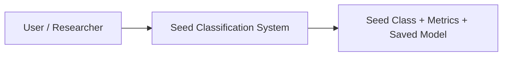
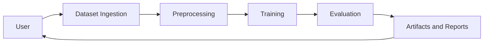
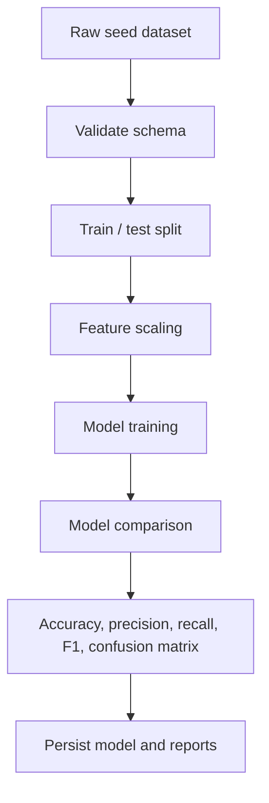
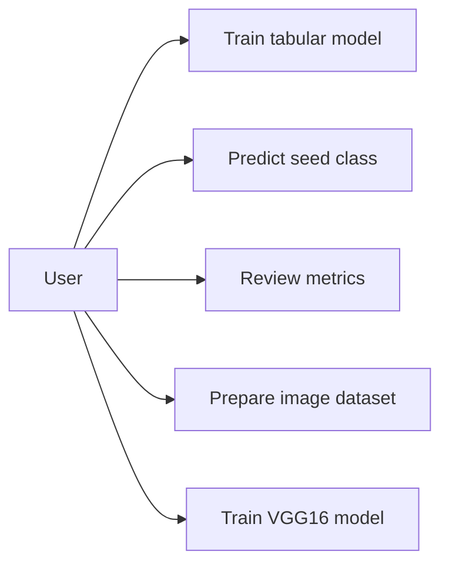
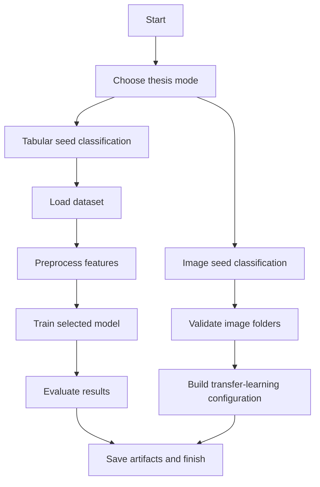
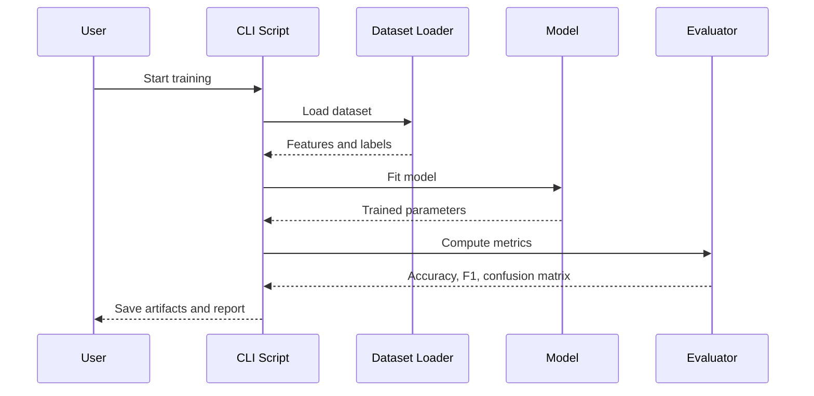

# System Design

This document converts the thesis design chapters into a project structure that is implementable in code.

## System Overview

The seed-classification system supports two flows:

- A feature-based tabular classifier for the UCI Seeds-style dataset
- An image-based classifier scaffold for the 14-class transfer-learning thesis variant

## DFD Level 0

## DFD Level 1

## DFD Level 2

## Use Case Diagram

## Activity Flow

## Sequence Diagram

## Feasibility Summary

- Technical feasibility: high for the tabular pipeline because it runs on NumPy and pandas only
- Economic feasibility: low entry cost because the current implementation avoids heavyweight infrastructure
- Operational feasibility: high because command-line scripts allow straightforward training and prediction
- Future feasibility: the image pipeline can be activated once the 14-class dataset and TensorFlow environment are available
